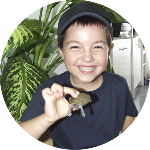
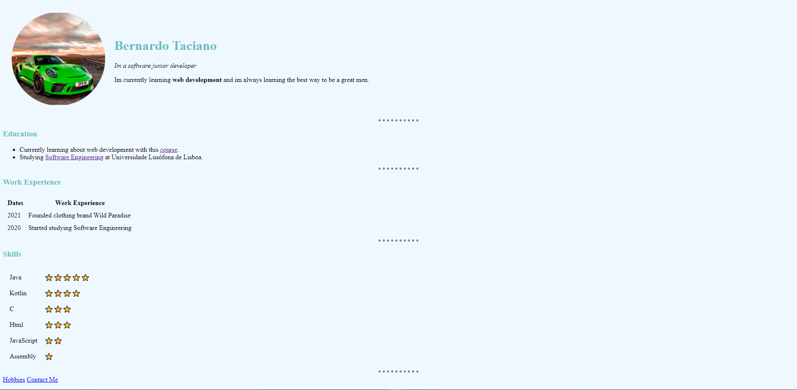

<h1>First Html & Css Project</h1>

 

  

  <h3 align="center">Bernardo Wikipedia</h3>

  

    Scroll to learn about my first html & css project.
     
  

 

<!-- TABLE OF CONTENTS -->

  
Table of Contents

   
  <ol>
    <li>
      <a href="#about-the-project">About The Project</a>
    </li>
    <li><a href="#contact">Contact</a></li>
  </ol>

<!-- ABOUT THE PROJECT -->
## About The Project

This was the first website developed in Html and CSS. The Html and CSS used served as an introduction to learning the same languages.

Its a simple website, that does not use advanced techniques, it only served to know small tricks.

(<a href="#readme-top">back to top</a>)

## Contact

Bernardo Taciano -  bernardotaciano1@gmail.com

Project Link: [https://github.com/bernardo-taciano-a22107478/cv](https://github.com/bernardo-taciano-a22107478/cv)

(<a href="#readme-top">back to top</a>)

